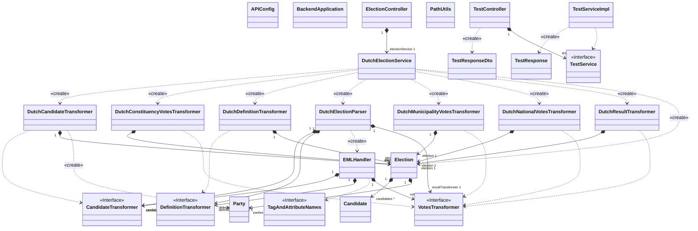

```mermaid
classDiagram
direction TB
class APIConfig
class BackendApplication
class Candidate
class CandidateTransformer {
<<Interface>>

}
class DefinitionTransformer {
<<Interface>>

}
class DutchCandidateTransformer
class DutchConstituencyVotesTransformer
class DutchDefinitionTransformer
class DutchElectionParser
class DutchElectionService
class DutchMunicipalityVotesTransformer
class DutchNationalVotesTransformer
class DutchResultTransformer
class EMLHandler
class Election
class ElectionController
class Party
class PathUtils
class TagAndAttributeNames {
<<Interface>>

}
class TestController
class TestResponse
class TestResponseDto
class TestService {
<<Interface>>

}
class TestServiceImpl
class VotesTransformer {
<<Interface>>

}

DutchCandidateTransformer  ..>  CandidateTransformer 
DutchCandidateTransformer "1" *--> "election 1" Election 
DutchCandidateTransformer  ..>  Party : «create»
DutchConstituencyVotesTransformer "1" *--> "election 1" Election 
DutchConstituencyVotesTransformer  ..>  VotesTransformer 
DutchDefinitionTransformer  ..>  DefinitionTransformer 
DutchDefinitionTransformer "1" *--> "election 1" Election 
DutchElectionParser "1" *--> "candidateTransformer 1" CandidateTransformer 
DutchElectionParser "1" *--> "definitionTransformer 1" DefinitionTransformer 
DutchElectionParser  ..>  EMLHandler : «create»
DutchElectionParser "1" *--> "resultTransformer 1" VotesTransformer 
DutchElectionService  ..>  DutchCandidateTransformer : «create»
DutchElectionService  ..>  DutchConstituencyVotesTransformer : «create»
DutchElectionService  ..>  DutchDefinitionTransformer : «create»
DutchElectionService  ..>  DutchElectionParser : «create»
DutchElectionService  ..>  DutchMunicipalityVotesTransformer : «create»
DutchElectionService  ..>  DutchNationalVotesTransformer : «create»
DutchElectionService  ..>  DutchResultTransformer : «create»
DutchElectionService  ..>  Election : «create»
DutchMunicipalityVotesTransformer "1" *--> "election 1" Election 
DutchMunicipalityVotesTransformer  ..>  VotesTransformer 
DutchNationalVotesTransformer "1" *--> "election 1" Election 
DutchNationalVotesTransformer  ..>  VotesTransformer 
DutchResultTransformer "1" *--> "election 1" Election 
DutchResultTransformer  ..>  VotesTransformer 
EMLHandler "1" *--> "candidateTransformer 1" CandidateTransformer 
EMLHandler "1" *--> "definitionTransformer 1" DefinitionTransformer 
EMLHandler  ..>  TagAndAttributeNames 
EMLHandler "1" *--> "votesTransformer 1" VotesTransformer 
Election "1" *--> "candidates *" Candidate 
Election "1" *--> "parties *" Party 
ElectionController "1" *--> "electionService 1" DutchElectionService 
TestController  ..>  TestResponseDto : «create»
TestController "1" *--> "testService 1" TestService 
TestServiceImpl  ..>  TestResponse : «create»
TestServiceImpl  ..>  TestService 

```