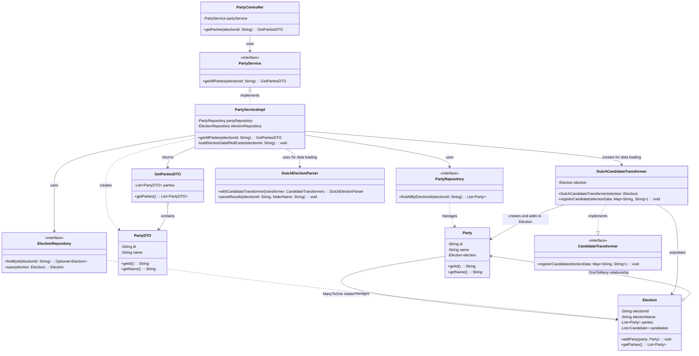

```mermaid
classDiagram
%% Controllers
    class PartyController {
        -PartyService partyService
        +getParties(electionId: String): GetPartiesDTO
    }

%% Services
    class PartyService {
        <<interface>>
        +getAllParties(electionId: String): GetPartiesDTO
    }

    class PartyServiceImpl {
        -PartyRepository partyRepository
        -ElectionRepository electionRepository
        +getAllParties(electionId: String): GetPartiesDTO
        -loadElectionDataIfNotExists(electionId: String): void
    }

%% Repositories
    class PartyRepository {
        <<interface>>
        +findAllByElectionId(electionId: String): List~Party~
    }

    class ElectionRepository {
        <<interface>>
        +findById(electionId: String): Optional~Election~
        +save(election: Election): Election
    }

%% DTOs
    class GetPartiesDTO {
        -List~PartyDTO~ parties
        +getParties(): List~PartyDTO~
    }

    class PartyDTO {
        -String id
        -String name
        +getId(): String
        +getName(): String
    }

%% JPA Entities
    class Election {
        -String electionId
        -String electionName
        -List~Party~ parties
        -List~Candidate~ candidates
        +addParty(party: Party): void
        +getParties(): List~Party~
    }

    class Party {
        -String id
        -String name
        -Election election
        +getId(): String
        +getName(): String
    }

%% Transformers
    class CandidateTransformer {
        <<interface>>
        +registerCandidate(electionData: Map~String, String~): void
    }

    class DutchCandidateTransformer {
        -Election election
        +DutchCandidateTransformer(election: Election)
        +registerCandidate(electionData: Map~String, String~): void
    }

    class DutchElectionParser {
        +withCandidateTransformer(transformer: CandidateTransformer): DutchElectionParser
        +parseResults(electionId: String, folderName: String): void
    }

%% Relationships
    PartyController --> PartyService: uses
    PartyService <|.. PartyServiceImpl: implements
    PartyServiceImpl --> PartyRepository: uses
    PartyServiceImpl --> ElectionRepository: uses
    PartyServiceImpl --> DutchElectionParser: uses for data loading
    PartyServiceImpl --> DutchCandidateTransformer: creates for data loading
    PartyServiceImpl ..> PartyDTO: creates
    PartyServiceImpl --> GetPartiesDTO: returns

GetPartiesDTO o--> PartyDTO: contains

Party --> Election: ManyToOne relationship
Election o--> Party: OneToMany relationship

PartyRepository ..> Party: manages
ElectionRepository ..> Election: manages

DutchCandidateTransformer ..|> CandidateTransformer: implements
DutchCandidateTransformer --> Election: populates
DutchCandidateTransformer --> Party: creates and adds to Election

```